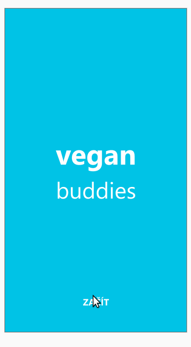

  Vegan buddies
-------------

A comunity for new vegans and those who want to guide them to success.

Follow our weekly progress on [veganbuddies.org](https://veganbuddies.org)!



Roadmap
==========

The goal of VeganBuddies is to connect new vegans with experience "vegan mentors" who are available to provide advice across a variety of situations. The ideal would be that every city or town would have at least one Vegan mentor in its vincinity.

Features

1. The ability to search for mentors on a map and chat with them
2. An interface for mentors to chat with mentees
3. Admin interface (can be a web app, does not need to be a native mobile app** - Approve new membors, registration form for new mentors.

** User interface **

- Mentor map
- Mentor profile
  - Fields
    - Name/nickname         - Leave to matrix
    - Photo                 - Leave to matrix
    - City + map            - In user index
    - Description/About me  - User index
    - Age(optional, or age group)  - User index
    - Contact methods (chat, email, telephone, personal meeting) - User index
    - Availability status   - User index
    - Matrix nick           - User index
    - Rating                - User index
  - Account deactivation
  - Account deleation
- Mentee profile
  - Fields
    - Name/nickname
    - password
    - email
  - Account deactiviation
  - Account deletion
  - The ability to "upgrade" from mentee to mentor (Optional, maybe at least re-use the same matrix account
- Chat widget
  - Chat between newbie and mentor
  - Chat with multiple parties
  - Emoji
  - Photos, videos, voice messages
  - Push notifications
 
** Interface for mentors **

Similar to/perhaps even the same as the one for mentees

Chat
  - See the mentees I'm currently talking to
  - Private mentor only rooms for discussion
  - Ability to PM Admins

Profile (Just a link into the lobste.rs profile)
 
** Administration interface **  

Public part
 - Registration form for mentors

Non-public part
 - Approving mentors
 - Blocking users
 - Deleting users
 - See and approve mentor ratings
 - The ability to edit mentor profiles
 - Password reset

Architecture
---------------

```
╭──────────────────────────────────────╮   ╭───────────────╮
│ Lobsters server                      │ → │  User index   │
│  Mentor invites                      │ ← │               │
╰──────────────────────────────────────╯   ╰───────────────╯
         ↓                                       ↓↑
╭──────────────────────────────────────╮   ╭───────────────╮
│  Mobile app (based on fluffychat)    │ → │ Matrix server │
│                                      │ ← │               │
╰──────────────────────────────────────╯   ╰───────────────╯
```

User index

 - User - table
  - Latitude and Longitude of users: postgis point
  - Lobste.rs address (If set and approved in lobste.rs they are a mentor): charfield max 255
  - matrix.org nick: charfield max 255
 - Test result - table
  - User: FK Relationship
  - Datetime
  - grade: int
  - answers: json
 - User rating - table
  - Rated user: FK relationship
  - Rating user: FK relationship
  - Rating: int
  - notes: Text

Querying for near by mentors
--------------

1. Look up near by mentors in mentor index.
2. Get display info for mentors by looking them up in the lobster server


Credits
-------

UX wireframes by [Petr Beneš](https://petben.cz/) @benyrfg
